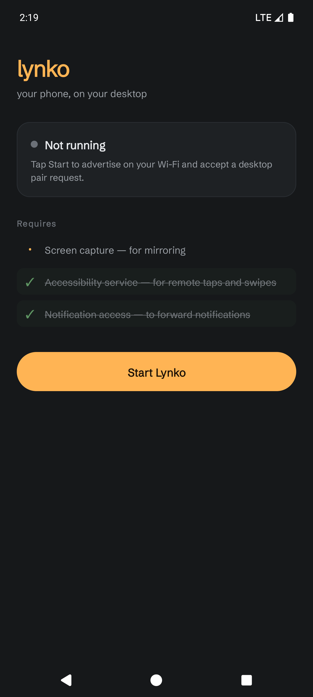

<div align="center">



# 📱 Lynko

**Your phone, on your desktop.**

Open-source Samsung Flow / AirDroid alternative — mirror and control **any Android phone** from your Windows PC over Wi-Fi.

**No USB cable · No USB debugging · No root · No cloud · No accounts**

[](https://github.com/ErfanBagheri404/Lynko/releases)
[](https://github.com/ErfanBagheri404/Lynko/releases)
[](#)
[](LICENSE)
[](https://github.com/ErfanBagheri404/Lynko/stargazers)

[Download](#-download) · [Features](#-features) · [Quick Start](#-quick-start) · [How It Works](#-how-it-works) · [Building](#-building) · [Roadmap](#-roadmap) · [FAQ](#-faq)

</div>

---

## ✨ Features

| | Feature | Description | Status |
|---|---|---|---|
| 🔍 | **Auto-discovery** | Finds your phone automatically via mDNS on the same Wi-Fi | ✅ |
| 🔐 | **PIN pairing** | 4-digit code shown on the phone, confirmed on the PC | ✅ |
| 🖥️ | **Live screen mirror** | Real-time phone screen streamed to a resizable desktop window | ✅ |
| 🖱️ | **Mouse → touch** | Click, scroll and swipe on your phone from your PC | ✅ |
| ⌨️ | **Keyboard → phone** | Type into any app via the Lynko IME | ✅ |
| 🔊 | **Audio streaming** | Hear your phone's audio on your PC speakers (16 kHz mono) | ✅ |
| 📋 | **Clipboard sync** | Copy on one device, paste on the other — both directions | ✅ |
| 📁 | **File transfer** | Drag & drop files PC → phone, saved to Downloads | ✅ |
| 🔔 | **Notification mirror** | See phone notifications on your desktop | ✅ |
| 🔋 | **Battery & status** | Live battery level and charging state | ✅ |
| 🌐 | **100% local** | No cloud servers. Your data never leaves your network | ✅ |
| 🌍 | **Multi-language** | English, فارسی (more via JSON locales) | ✅ |

## 📥 Download

Grab the latest build from [**Releases**](https://github.com/ErfanBagheri404/Lynko/releases):

| Platform | Files |
|---|---|
| 🪟 **Windows** | `Lynko_x64-setup.exe` (installer) · `.msi` · portable `.zip` |
| 🤖 **Android** | `lynko-<flavor>-<abi>.apk` — pick **`universal`** if unsure |

### Android flavors

| Flavor | For |
|---|---|
| `base` / `play` | Google Play countries |
| `bazaar` / `myket` | Iran (Café Bazaar / Myket stores) |

## 🚀 Quick Start

**Phone**
1. Install the APK (allow "install unknown apps" if asked)
2. Open Lynko → tap **Start**
3. Grant: screen capture, accessibility, notifications (checklist turns green ✓)

**PC**
1. Install / run Lynko
2. Your phone appears — click **Pair**, enter the PIN shown on the phone (**1234** by default)
3. Done — screen, audio, input, files and clipboard are live

> 💡 Both devices must be on the same Wi-Fi / LAN. No USB, no ADB, no developer options — ever.

## 🧠 How It Works

```text
┌──────────────────┐   mDNS discovery (port 7912)   ┌──────────────────┐
│   Windows PC     │ ──── HTTP pairing (PIN) ─────► │   Android phone   │
│  Tauri 2 + Rust  │ ──── WebSocket link :7913 ──── │  Kotlin (native)  │
│                  │      JSON control + binary      │                   │
│  WebView UI      │   LV1/JPEG frames · LF1 audio   │  MediaProjection  │
└──────────────────┘                                 └──────────────────┘
```

- **Rust core** (`core/`) — protocol, framing (`LV1` video, `LF1` audio), shared by both sides
- **Desktop** (`desktop/`) — Tauri 2, React + TypeScript, native window drop
- **Phone** (`android/`) — Kotlin, no third-party heavy deps
- **mDNS + HTTP pair** — zero-config discovery, PIN-verified handshake
- **One WebSocket** — control JSON and binary frames multiplexed, lock-guarded writer

Nothing routes through the internet. Works on airplane-mode Wi-Fi.

## 🛠️ Building

```bash
# Desktop (Windows)
cd desktop && npm ci && npm run tauri build

# Android (debug)
cd android && ./gradlew assembleBaseDebug

# Rust core tests
cd core && cargo test
```

## 🗺️ Roadmap

- [ ] Hardware H.264 encoding (scrcpy-level CPU usage)
- [ ] Phone → PC file transfer
- [ ] TLS on the link socket + rotating PIN
- [ ] Phone-side send history & device avatars (LocalSend-inspired)
- [ ] Linux / macOS desktop builds
- [ ] Remote notifications quick-reply

## ❓ FAQ

<details>
<summary><b>Do I need USB debugging?</b></summary>
No. Lynko never touches ADB. Pairing is PIN-based over your LAN.
</details>

<details>
<summary><b>Is my data sent anywhere?</b></summary>
No cloud, no accounts, no telemetry. All traffic stays on your local network.
</details>

<details>
<summary><b>Why a PIN?</b></summary>
The 4-digit PIN (shown on the phone) prevents a stranger on the same Wi-Fi from pairing silently.
</details>

<details>
<summary><b>iOS / iPhone support?</b></summary>
Not planned — Apple's platform doesn't allow screen capture the way Android does.
</details>

## 🙏 Credits

- [LocalSend](https://localsend.org) (Apache-2.0) — design inspiration
- Built with [Tauri 2](https://tauri.app), [Rust](https://rust-lang.org), [Kotlin](https://kotlinlang.org), [mDNS/NsdManager](https://developer.android.com/training/connect-devices-wirelessly/nsd)

<div align="center">

**Apache-2.0** · Made with 🧡 by [ErfanBagheri404](https://github.com/ErfanBagheri404)

</div>
